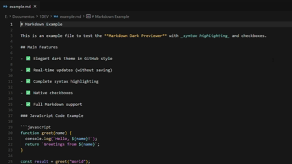

# Markdown Dark Preview

A beautiful Visual Studio Code extension for previewing Markdown files with an elegant GitHub Dark theme. Features live updates, syntax highlighting, and seamless synchronization between preview and editor.

## 🎥 Demo



## ✨ Features

- 🌙 **Elegant Dark Theme** - GitHub Dark-inspired styling for comfortable viewing
- ⚡ **Live Updates** - Changes reflect instantly as you type, no save required
- 🎨 **Full Syntax Highlighting** - Code blocks with GitHub Dark color scheme
- ✅ **Task Lists** - Native checkbox rendering with proper styling
- 🔄 **Bidirectional Sync** - Double-click any text in preview to jump to source
- ⌨️ **Keyboard Shortcut** - Quick access with `Ctrl+Shift+V` (or `Cmd+Shift+V` on Mac)
- 📝 **Full Markdown Support** - Tables, code, lists, images, and more
- 🚀 **High Performance** - Optimized rendering with debouncing and caching
- 🎯 **Precise Navigation** - Smart text matching for accurate cursor positioning

## 🚀 Quick Start

1. Open a Markdown file (`.md`) in the editor
2. Press `Ctrl+Shift+V` (Windows/Linux) or `Cmd+Shift+V` (Mac)
3. A new preview panel opens with the dark theme
4. Edit your file and watch changes appear in real-time!

### Using Command Palette

- Press `Ctrl+Shift+P` (or `Cmd+Shift+P` on Mac)
- Type "Open Markdown Preview (Dark Theme)"
- Press Enter

## 🎯 Key Features Explained

### Live Preview Updates

The preview automatically updates as you type, with intelligent debouncing to ensure smooth performance even during rapid editing.

### Bidirectional Synchronization

**Double-click any text in the preview** to instantly jump to that location in the source editor. The extension:

- Finds the exact line and column position
- Matches selected text for precise navigation
- Reveals the location in the center of the editor view

### Syntax Highlighting

Full syntax highlighting support for **190+ programming languages** including:

- JavaScript / TypeScript
- Python
- Java / C++ / C# / Go / Rust
- HTML / CSS / SCSS
- JSON / YAML / XML
- Bash / PowerShell
- SQL
- And many more...

## 📦 Installation

### From VS Code Marketplace

1. Open Visual Studio Code
2. Go to Extensions view (`Ctrl+Shift+X`)
3. Search for "Markdown Dark Preview"
4. Click "Install"

### Manual Installation

1. Clone this repository
2. Run `npm install` to install dependencies
3. Run `npm run compile` to compile TypeScript
4. Press `F5` to open a new VS Code window with the extension loaded

## 📋 Requirements

- Visual Studio Code 1.80.0 or higher

## 📝 Supported Markdown Features

- Headers (H1-H6)
- Bold and italic text
- Ordered and unordered lists
- Task lists (checkboxes) with native rendering
- Links and images
- Code blocks with full syntax highlighting
- Inline code
- Blockquotes
- Tables
- Horizontal rules
- Strikethrough

## 🛠️ Development

```bash
# Install dependencies
npm install

# Compile the code (for development)
npm run compile

# Watch mode for development
npm run watch

# Package for production (bundles with webpack)
npm run package
```

### Building for Production

The extension uses **webpack** to bundle all dependencies into a single optimized file. This reduces the extension size significantly:

- **Development**: Uses TypeScript compiler directly (`npm run compile`) - faster for debugging
- **Production**: Uses webpack bundler (`npm run package`) - optimized single-file bundle (~1MB)

When you publish the extension, webpack automatically bundles all dependencies, so `node_modules` is not included in the published package.

## 🎨 Theme Colors

The preview uses the official GitHub Dark theme colors:

- Background: `#0d1117`
- Text: `#e6edf3`
- Keywords: `#ff7b72`
- Strings: `#a5d6ff`
- Functions: `#d2a8ff`
- Variables: `#79c0ff`
- Comments: `#8b949e`

## 🔧 Technical Details

### Performance Optimizations

- **Debouncing**: Updates are debounced (150ms) to prevent excessive rendering
- **Content Caching**: Renders only when content actually changes
- **Efficient Parsing**: Uses markdown-it for fast, extensible parsing
- **Smart Updates**: Only updates visible previews

### Technologies Used

- `markdown-it` - Powerful and extensible Markdown parser
- `highlight.js` - Syntax highlighting for 190+ languages
- `markdown-it-task-lists` - Task list (checkbox) support

## 📖 Usage Tips

1. **Multiple Previews**: Each Markdown file can have its own preview panel
2. **Auto-refresh**: Preview updates automatically when you save or edit
3. **Quick Navigation**: Double-click in preview to jump to source
4. **Keyboard Shortcut**: Use `Ctrl+Shift+V` for instant preview access

## 🤝 Contributing

Contributions are welcome! Please feel free to submit a Pull Request.

## 🐛 Issues

If you encounter any issues or have feature requests, please open an issue on GitHub.

## 📄 License

MIT License - feel free to use this extension in your projects.

## 🙏 Credits

- Styles inspired by GitHub Dark theme
- Built with [markdown-it](https://github.com/markdown-it/markdown-it)
- Syntax highlighting powered by [highlight.js](https://highlightjs.org/)

---

## ⭐ Support This Project

If you find this extension useful, please consider giving it a star on GitHub! It helps others discover the project and motivates continued development.

[](https://github.com/jmcoronato/markdown-dark-preview)

**[⭐ Star this repository on GitHub](https://github.com/jmcoronato/markdown-dark-preview)**

---

**Enjoy your Markdown editing with a beautiful dark preview!** 🌙
